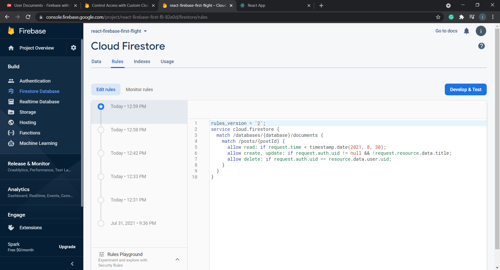

# Security Rules

## Additional things to learn

- Custom Claims [#](https://firebase.google.com/docs/auth/admin/custom-claims)
- Here google api is providing us the user info but if we want to let our user change their profile pictures and what now, we can use custom claims. Sry about the words i just dont know is it a feaure or a word .

You write security rules in the [firebase console](https://console.firebase.google.com/project/react-firebase-first-fli-82e0d/firestore/rules).

Which looks something like.



Sample rule:

This is what you get by default.

```sql
rules_version = '2';

service cloud.firestore {

  match /databases/{database}/documents {

    match /{document=**} {

      allow read, write: if

          request.time < timestamp.date(2021, 8, 30);

    }

  }

}

```

## Another example - more detailed

This rule does the following things

- A user can `read` any post (logged in or not).
- Can only `create`, `update` (granular version of `write`) a post if logged in.
- A user can only delete its own post.

```sql
rules_version = '2';
service cloud.firestore {
  match /databases/{database}/documents {
    match /posts/{postId} {
      allow read: if request.time < timestamp.date(2021, 8, 30);
      allow create, update: if request.auth.uid != null && !request.resource.data.title;
      allow delete: if request.auth.uid == resource.data.user.uid;
    }
  }
}
```
