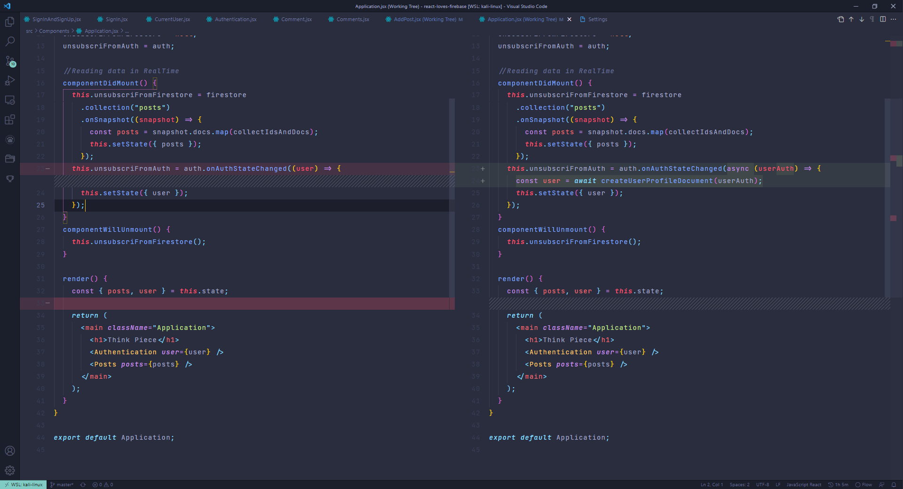

# Setting Up Authentication With Email

To set up email auth we need to make our own custom user profiles.

Todo that we'll make following two functions like `signUpWithGoogle()` inside the `firebase.js` file.

Just a utility function to get user data.
```js
export const getUserDocument = async (uid) => {
  if (!uid) return null;
  try {
    const userDocument = await firestore.collection('users').doc(uid).get();
    return { uid, ...userDocument.data() };
  } catch (error) {
    console.error('Error in fetching the user', error.message);
  }
}
```

This one will create user profiles inside a `users` collection in our firebase app.
```js
export const createUserProfileDocument = async (user, additionalData) => {
  // if there is no user do nothing
  if (!user) return;
  // check if document exists : get a reference to the place in the database where a user profile might be
  const userRef = firestore.doc(`users/${user.uid}`);
  // go and fetch document from that location
  const snapshot = await userRef.get();
  // snapshot have  a property called snapshot
  /**
   * querySnapshot : exist
   * documentSnapshot: exists
   */
  if (!snapshot.exists) {
    const createdAt = new Date().toDateString();
    const { displayName, email, photoURL } = user;
    try {
      await userRef.set({
        displayName,
        email,
        photoURL,
        createdAt,
        ...additionalData
      });
    } catch (error) {
      console.error('Error in creating user', error);
    };
  }
  return getUserDocument(user.uid);
}
```

### Note:

- Make sure that everytime you log in you don't delete the previous user info. If email exists log into it if not make an account.

**Then you can just add those functions like this**

