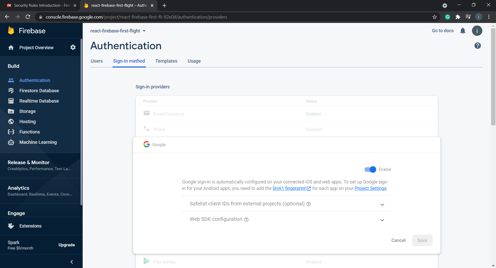

# OAuth Setup

## Enable SignIn Signup

### `auth.currentUser` is the current user object

- Step 1: First you need to enable authentication by `left-side-bar => Authentication => SignIn Method`



- Step 2: Setting up authentication in your firestore

```js
import firebase from "firebase/app";
import "firebase/firestore";
import "firebase/auth";

// Your web app's Firebase configuration
// For Firebase JS SDK v7.20.0 and later, measurementId is optional
var firebaseConfig = { ... };
// Initialize Firebase
firebase.initializeApp(firebaseConfig);

export const firestore = firebase.firestore();
export const auth = firebase.auth();

export const provider = new firebase.auth.GoogleAuthProvider();
export const signInWithGoogle = () => auth.signInWithPopup(provider);
export const signOut = () => auth.signOut();

export default firebase;
```

- Step 3: Now you can use `signInWithGoogle` at anyplace you want. Like I've used here [#](../src/Components/SignInAndSignUp.jsx).

```js
// import { signInWithGoogle } from './firebase.js';

<button onClick={signInWithGoogle}>Sign In With Google</button>
```

- Step 4: Accessing the user object returned by `auth.onAuthStateChanged` or `auth` as you may've been thinking.

```js
state = {
    posts: [],
    user: null,
  };

  unsubscriFromFirestore = null;
  unsubscriFromAuth = auth;

  //Reading data in RealTime
  componentDidMount() {
    this.unsubscriFromFirestore = firestore
      .collection("posts")
      .onSnapshot(...);
    // This will make sure that when ever user logs out state of application will change
    this.unsubscriFromAuth = auth.onAuthStateChanged((user) => {
      this.setState({ user });
    });
  }
  componentWillUnmount() {
    this.unsubscriFromFirestore();
  }

```

- Step 5: User Object in `state = { ... }`. Since we are monitoring the change of state of auth so we can access `this.state.user` at any time. Link I've done here [#](../src/Components/Application.jsx) Line 37 or something.

## Users who tried to Logged in


