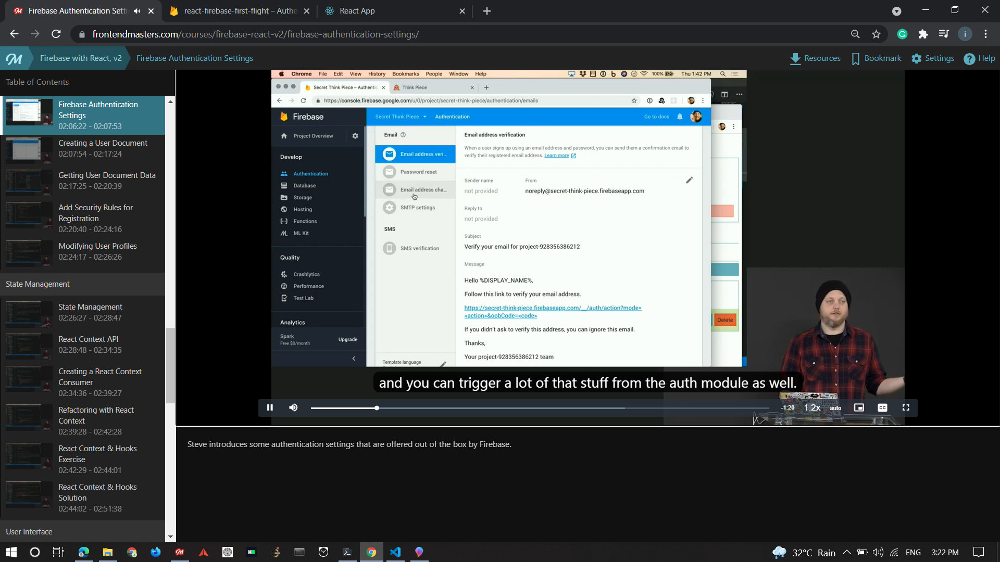
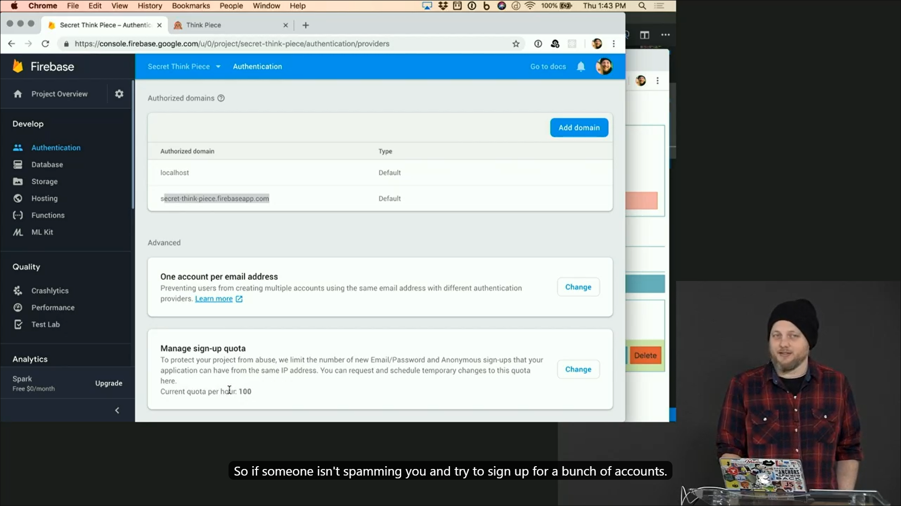

# Sign up and Log in with Email

## Sign up with Email

Exact code that you need for your signup button.

```js
handleSubmit = async (event) => {
  event.preventDefault();
  const { email, password, displayName } = this.state;
  try {
    const { user } = await auth.createUserWithEmailAndPassword(email, password);
    user.updateProfile({ displayName });
  } catch (err) {
    console.error(err);
  }
  this.setState({ displayName: "", email: "", password: "" });
};
```

Signup is fairly simple because data base will update itself automatically.
You don't even have to worry about even the state change beacause it triggers automtically once someone logs in or out.

Since we don't have any way to set up the stuff like `displayName`. We'll create the object first and then set the properties later. With this `user.updateProfile({ displayName });`.

But there is a catch since UI renders only when someone logs in out out or someone creates a post we won't see those updated properties in effect untill after UI is rendered once more and since we are just mutating one string react won't notice the state change.

## LogIn

Now this is the main part. Sign up is the easy part here we have to do a little work.

## Additional Features

Since email auth is fairly simple. Firebase provides us with some inbuild features such as that `gmail authentication` thing. Limit number of users from a particular `ip address`. Logging in and out perhour.




